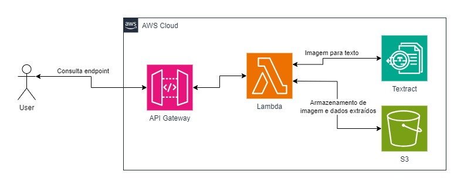

# Projeto 3 (Sprint 4, 5 e 6)

Avaliação das quarta, quinta e sexta sprints do Scholarship Compass UOL para formação em Inteligência Artificial para AWS.

***

## Execução (Código Fonte)

Faça uma API REST via POST em Python para receber a imagem de uma nota fiscal eletrônica em formato simplificado e armazenar em bucket S3. Esta nota deve ser transcrita pelo Textract, e ter seus elementos discriminados utilizando-se recursos de NLP. Utilizar o CloudWatch para gravar os logs dos resultados.

**Especificações**:

1. Desenvolver uma API REST via POST em Python para receber um arquivo de nota fiscal e devolver as especificações segundo detalhamento a seguir. Usar como base as notas da pasta [dataset](<./dataset>). Utilize a rota _/api/v1/invoice_ .

   * Referência para upload de arquivo: [Uploading Files to S3 Using API Gateway via Lambda Function](https://readmedium.com/uploading-files-to-s3-using-api-gateway-via-lambda-function-57fb160f7b7c)
2. Armazenar o arquivo da nota fiscal em bucket S3.
3. Processar os dados da nota fiscal colocada no bucket S3 através do processamento da imagem, uso do Textract, além de processamento de linguagem com uso de Spacy ou NLTK, para cobertura de todas as possibilidades de identificação dos elementos.

   * Referências:
     * [Analisando faturas e recibos com o Amazon Textract](https://docs.aws.amazon.com/pt_br/textract/latest/dg/analyzing-document-expense.html)
     * [Analisando faturas e recibos](https://docs.aws.amazon.com/pt_br/textract/latest/dg/invoices-receipts.html)
     * [Amazon Textract - Building a Receipt Processing Solution](https://github.com/raminetinati/aws-demo-textract-receipts)
4. Aplicar uma LLM para refinamento dos dados de saída e formatação em JSON.
   * Referência: [Finetune LLM to convert a receipt image to json or xml](https://mychen76.medium.com/finetune-llm-to-convert-a-receipt-image-to-json-or-xml-3f9a6237e991)
5. Mover no bucket S3 a notas pagas em dinheiro ou pix para uma pasta "dinheiro" ou para a pasta "outros" caso outras formas de pagamento.
6. Devolver a resposta ao usuário contendo os dados da nota fiscal.

7. Exemplos completos:
    * [Build a receipt and invoice processing pipeline with Amazon Textract](https://aws.amazon.com/pt/blogs/machine-learning/build-a-receipt-and-invoice-processing-pipeline-with-amazon-textract/)
    * [Modelo sem cloud](https://github.com/katanaml/sparrow)

8. Dica 1: usar padrões de status code como resposta - [HTTP response status codes](https://developer.mozilla.org/en-US/docs/Web/HTTP/Status)
9. Dica 2: o uso de AWS CDK e/ou Step Functions é livre conforme interesse da equipe.

## Arquitetura Básica



## Formatos

* Requisição
  * Não há conteúdo em body. Exemplo de comando curl:
  
```shell
  curl --location --request POST 'http://<URL>/api/v1/invoice' --form 'file=@"<Nome do arquivo>"'
```

* Resposta
  * Utilizar estes campos para retorno de identificação de dados
  
```json
{
    "nome_emissor": "<nome-fornecedor>"
    "CNPJ_emissor": "00.000.000/0000-00",
    "endereco_emissor": "<endereco-fornecedor>"
    "CNPJ_CPF_consumidor": "000.000.000-00",
    "data_emissao": "00/00/0000",
    "numero_nota_fiscal": "123456",
    "serie_nota_fiscal": "123",
    "valor_total": "0000.00",
    "forma_pgto": "<dinheiropix/outros>"
}
```

_Importante_: para campos não identificados, colocar ``None``.

***

## O que será avaliado?

* Uso de Python no projeto;
* Projeto em produção na cloud AWS;
* Uso do CloudWatch para gravar os logs dos resultados;
* Seguir as atividades na ordem proposta;
* Subir códigos no git ao longo do desenvolvimento;
* Organização geral do código fonte:
  * Estrutura de pastas;
  * Estrutura da lógica de negócio;
  * Divisão de responsabilidades em arquivos/pastas distintos;
  * Otimização do código fonte (evitar duplicações de código);
* Objetividade do README.md;
* Modelo de organização da equipe para o desenvolvimento do projeto.

***

## Entrega

* **O trabalho será feito em squad**;
* Criar uma branch no repositório com o formato squad-número (exemplo: squad-1);
* Subir o trabalho na branch da equipe com um README.md:
  * Documentar detalhes sobre como a avaliação foi desenvolvida;
  * Relatar dificuldades conhecidas;
  * Descrever como utilizar o sistema;
  * Fornecer a URL para acesso à API;
* 🔨 Disponibilizar o código fonte desenvolvido (observar estruturas de diretórios);
* O prazo de entrega é até às 23:59h do dia 11/08/2025 no repositório do github (<https://github.com/Compass-pb-aws-2025-MAIO/sprints-4-5-6-pb-aws-maio>).
***